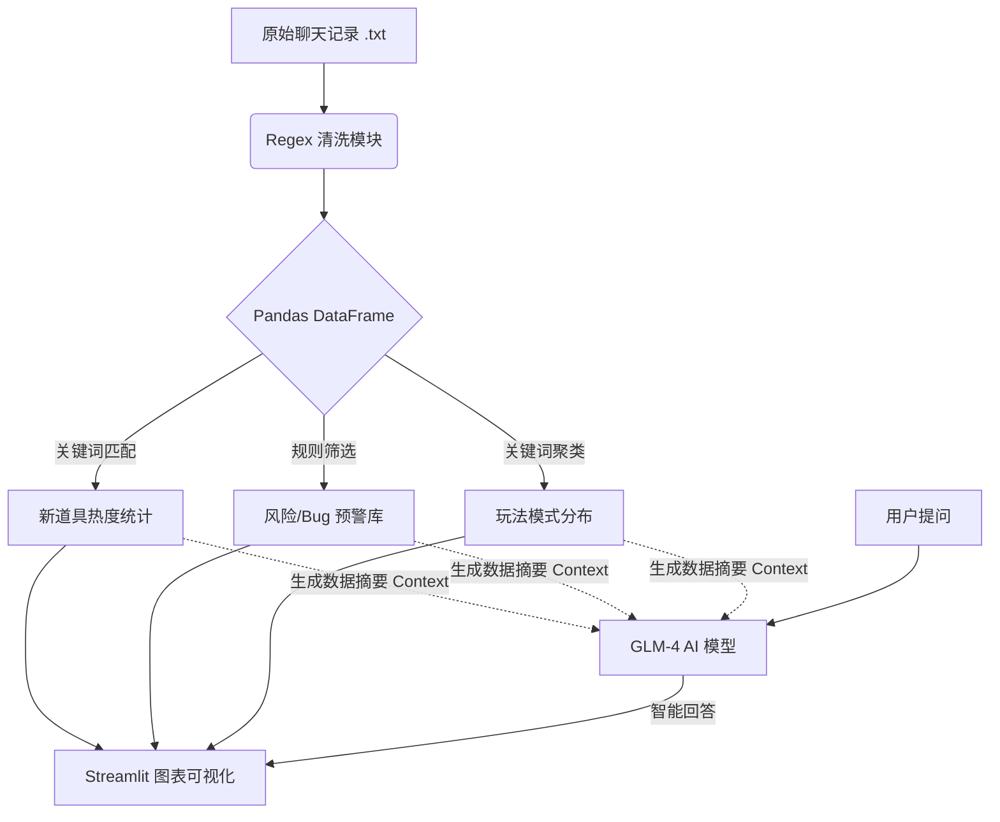

## 思路复盘 (The Logic)

本项目采用 **“传统规则统计 + 大模型语义分析”** 的混合驱动架构。考虑到舆情分析的时效性和准确性，未将所有原始数据直接灌入 LLM，而是设计了分层处理流水线。

### 1. 技术架构方案

* **开发语言**：Python 3.9
* **前端交互**：Streamlit (选择理由：Python 原生，无需前后端分离，适合快速构建数据看板 MVP)
* **数据处理**：Pandas (用于高效的向量化文本过滤与聚合) + Regex (正则解析)
* **AI 模型**：智谱 AI **GLM-4-Flash** (选择理由：响应速度快、成本低，足以处理摘要与情感分析任务)
* **安全管理**：使用 `Streamlit Secrets` 管理 API Key，确保敏感信息不硬编码进代码库。

### 2. 数据处理与长文应对策略 (Handling Long Context)

面对大量的群聊记录，直接将全量文本发送给 LLM 会导致 Token 溢出且增加成本。我采用了 **RAG-Lite (轻量级检索增强)** 的策略：

1. **预处理 (Pre-processing)**：
* 利用正则表达式清洗非结构化文本，提取 `时间`、`用户ID`、`消息内容` 三个关键字段，转化为结构化的 DataFrame。


2. **分层分析 (Layered Analysis)**：
* **L1 统计层**：使用 Python 原生算法计算关键词频次、筛选风险词条。这部分处理全量数据，速度极快。
* **L2 语义层**：仅将“L1计算出的统计摘要”和“筛选出的关键评论片段（Top K）”作为 Context 发送给 LLM。


3. **Prompt 构造**：
* **System Prompt** 中注入了由 Python 动态生成的 `context_summary`（包含热词 Top3、风险条数、典型 Risk Case）。
* 这样 AI 既拥有了宏观的数据视野，又不需要阅读几十兆的原始日志。


### 3. 核心指标定义

为了满足业务需求，我对模糊的概念进行了工程化定义：

#### (1) 受欢迎程度 (Popularity)

采用 **定成量 + 定性** 的双重验证：

* **量化指标 (Quantitative)**：**提及率 (Mention Frequency)**。定义为 `该物品关键词在总消息中出现的次数`。
* **定性指标 (Qualitative)**：**情感倾向 (Sentiment)**。通过抽取包含该关键词的上下文（Window Size），通过 LLM 判断玩家是在“许愿/夸赞”还是“吐槽/抱怨”。
* *逻辑体现：代码中点击“分析玩家态度”按钮，即触发此定性分析。*


#### (2) 风险 (Risk)

采用 **基于词库的规则匹配 (Lexicon-based Matching)**，以确保 0 延迟和 100% 召回率：

* **定义**：任何包含以下关键词的消息被视为“高风险”。
* **词库构建**：
* **性能类**：`卡顿`, `闪退`, `PPT`, `发烫`
* **合规类**：`外挂`, `脚本`, `加速器`
* **体验类**：`Bug`, `太难`, `数值崩坏`, `垃圾`, `削弱`


* *优势：相比 AI 自动识别，规则匹配能保证即使 AI 幻觉或服务宕机，核心报警功能依然可用。*

### 4. 模型 Prompt 设计

在与 AI (GLM-4) 交互时，我使用了 **角色扮演 (Role-Playing)** + **数据注入 (Context Injection)** 的技巧。

**使用的 System Prompt 模板：**

```python
system_prompt = f"""
你是一个专业的游戏数据分析师。
请基于以下数据摘要回答用户问题（不要编造数据）：
{context_summary}  <-- 这里是由 Python 代码计算出的动态数据

如果用户问及具体细节，请根据常识和数据倾向进行专业回答。
"""

```

通过这种方式，AI 被限制在客观数据的范围内回答，减少了“一本正经胡说八道”的幻觉风险。

---

### (可选) 你的协作流程图

如果你想让文档看起来更高端，可以加上这个 Mermaid 流程图代码（GitHub 支持直接渲染）：


